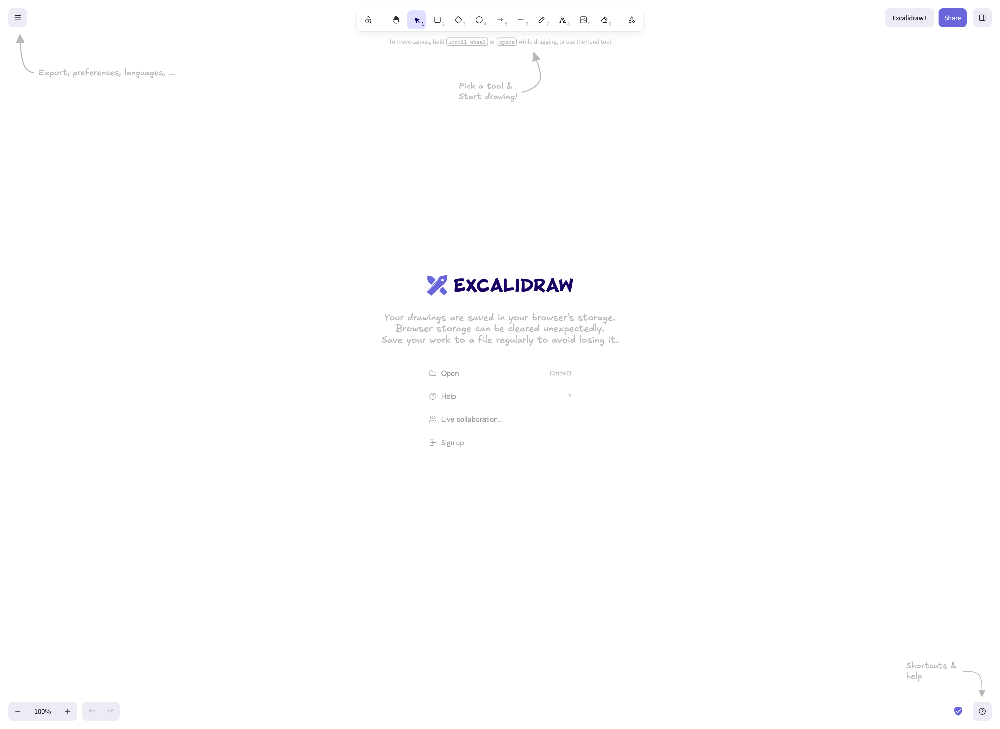
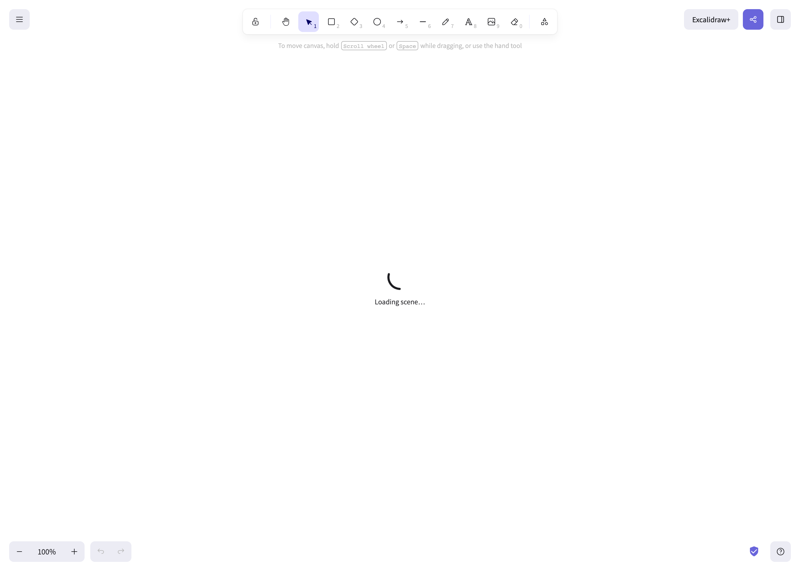

# Hermes Agent — r00tcc's Deployment

**Version:** 0.13.0 (forked from [NousResearch/hermes-agent](https://github.com/NousResearch/hermes-agent))  
**Platform:** macOS (Darwin 26.5) — local deployment  
**Primary LLM:** Volcengine Ark / GLM-5.1  
**Primary Channel:** Feishu (Lark)

A heavily customized AI agent deployment with CMA-inspired traceability (ToolResult + Session Event Log), a 4-layer persistent memory system, MCP-powered tool ecosystem, and Honcho-backed multi-agent collaboration.

---

## Architecture Overview



---

## Memory System (4-Layer + Hindsight)

**Quick reference:** [Architecture Diagram →](docs/diagrams/hermes-architecture.html) · [Memory Flow Diagram →](docs/diagrams/hermes-memory-flow.html)

| Layer | Name | Storage | Access | Retention |
|-------|------|---------|--------|-----------|
| **L0** | Injected Context | MEMORY.md (2200c) · USER.md (1375c) · AGENTS.md | Auto-injected every turn | Session-persistent |
| **L1** | Working Memory | Session history · context compression | Conversation loop | Session ephemeral |
| **L2** | OpenViking KB | Docker (port 1933) · Sentence embeddings | `viking_search` / `viking_read` / `viking_remember` | Permanent |
| **Hindsight** | Graph Reasoning | PostgreSQL + pgvector · Docker (port 18888) | `mcp_hindsight_recall` / `mcp_hindsight_reflect` | Permanent |
| **L3** | Evolution Signals | Skills directory (55+ SKILL.md files) | `skill_manage` / `skills-quality` MCP | Permanent |



**Key features:**
- **Dual-write**: `memory` tool writes to both L0 (MEMORY.md) and L2 (OpenViking) simultaneously
- **Unified recall**: `memory_recall()` queries all layers, deduplicates, ranks by relevance
- **Context compression**: at 0.40 threshold, protects last 8 turns
- **Session search**: FTS5 across past conversations, LLM-summarized results
- **SOUL.md**: persona/voice/style definitions for multi-personality (15+ personalities)

---

## CMA-Inspired Enhancements

This deployment includes architectural improvements inspired by Anthropic's Claude Managed Agent (CMA) paper:

1. **ToolResult** (`agent/tool_result.py`) — Structured tool execution output capturing:
   - Status (success/error), duration, error messages
   - Standardized metadata for analysis

2. **SessionEventLog** (`agent/session_event_log.py`) — Append-only structured event log:
   - Event types: `tool_call`, `tool_result`, `brain_invoke`, `session_start`, etc.
   - JSONL format for replay and self-analysis
   - Foundation for harness isolation and traceability

---

## MCP Server Ecosystem

| MCP Server | Purpose | Status | Port/Endpoint |
|-----------|---------|--------|---------------|
| **beads** | Task/issue tracking | ✅ Healthy | local bd CLI |
| **hindsight** | Graph-based memory reasoning | ✅ Healthy | :18888 |
| **sirchmunk** | Local file/document search | ✅ Healthy | local binary |
| **deepcode** | Code AI (planning/coding) | ✅ Healthy | :8000 |
| **deeptutor** | Interactive learning/tutoring | ✅ Healthy | :8001 |
| **deerflow** | Deep research & analysis | ✅ Healthy | local config |
| **browser-harness** | CDP-based browser automation | ✅ Healthy | :9222 |
| **skills-quality** | Skill scoring & validation | ✅ Healthy | MCP tool |
| **simplemem** | Long-term memory store | ✅ Healthy | local |

**Disabled by default:**
- CodeGraph MCP — too large (6KB schema per turn), enabled on demand via `/tools enable mcp-codegraph`

---

## Skills System

55+ skills organized across categories:

- **Development**: python, git, code-review, debug, testing
- **DevOps**: docker, nginx, db-admin, terraform
- **Security**: CTF-master, pwn, crypto-comprehensive, github-security-hardening
- **Research**: claude-managed-agents-research, deep-research, research-synthesis
- **Document/Markdown**: MD-to-HTML-report, diagrams, creative writing
- **Social/Media**: twitter-polisher, email, feeds
- **Productivity**: bloom-prompt-framework, gsd-workflow, kms-5-layer-process
- **Tool-specific**: hermes-agent, sn-* series, yuambao

**Quality scoring**: skills-quality MCP scores each skill (0-10) across 5 pedagogic dimensions.

---

## Platforms

| Platform | Status | Channel |
|----------|--------|---------|
| **Feishu (Lark)** | ✅ Primary | `oc_cb1804a2524577adba20634a65394b81` (Home) |
| **API Server** | ✅ Enabled | `localhost:8642` |
| **CLI** | ✅ Always available | macOS terminal |
| **Telegram** | 🔌 Configured | Channel prompts defined |
| **Discord** | 🔌 Configured | Auto-thread, reactions |
| **Slack** | 🔌 Configured | Channel prompts |

---

## Configuration Highlights

| Setting | Value |
|---------|-------|
| Max turns per session | 90 |
| Context compression threshold | 0.50 (protect_last_n: 20) |
| Delegation (sub-agents) | max 3 concurrent, max 50 iterations |
| Cron jobs | Enabled (wrap_response: true) |
| Memory flush min turns | 6 |
| Skill creation nudge | Every 15 turns |
| Honcho (L4 multi-agent) | Enabled, :8889, peer: r00tcc |
| TTS Engine | Edge TTS (Aria) |
| Image Generation | MiniMax CLI (`mmx`) |

---

## Changelog

### 2026-05-19 — CMA Traceability + Documentation Rewrite
- ✅ **ToolResult** standardisation — structured tool execution wrapper
- ✅ **SessionEventLog** — append-only JSONL event log for traceability
- ✅ **README rewrite** — full documentation based on actual deployment state
- ✅ **Architecture diagram** — updated to reflect current component structure
- ✅ **Memory flow diagram** — updated with L3 session event log integration
- ✅ **Removed evolver** — replaced DSPy-based evolver with CMA-inspired Traceability

### 2026-05-18 — Context Config Optimization
- ✅ Context: max_turns=40, compression.threshold=0.40, protect_last_n=8
- ✅ Hygiene hard message limit: 100
- ✅ Removed deprecated `evolver/` directory

### 2026-05-17 — Multi-Agent v2 Plan
- ✅ Multi-agent team architecture design v2 (docs/multi-agent-team-v2.md)
- ✅ 4-layer hierarchy: L0 Lead → L1 Profile → L2 delegate_task → L3 cron
- ✅ Git worktree isolation, Honcho shared memory, Beads task board, Mailbox protocol

### 2026-05-16 — OpenViking Fix & Skills Expansion
- ✅ OpenViking: port 1933, SiChuan Flow embeddings (BAAI/bge-large-zh-v1.5)
- ✅ All Viking tools verified (search/read/browse/remember/add_resource)
- ✅ Skills: CTF-master, pwn, crypto-comprehensive, security toolkit

### 2026-05-15 — Git Security Hardening
- ✅ `.gitignore` updated — evolver/, hermes_memory_data/, .wolf/, secrets excluded
- ✅ Security audit workflow documented

### 2026-04-26 — Provider Switch to Volcengine / GLM-5.1
- ✅ Default provider: Volcengine Ark (GLM-5.1)
- ✅ MiniMax CLI for image generation

### 2026-04-19 — Initial Fork & Customisation
- ✅ Forked NousResearch/hermes-agent v0.13.0
- ✅ MEMORY.md / USER.md / AGENTS.md customised
- ✅ BLOOM methodology adopted
- ✅ Multi-agent team Phase 1-3 deployed
- ✅ Honcho L4 SINK bridge — GLM-5.1 dialectic engine
- ✅ Constitution governance system (Phase 1)

---

## Quick Start (For This Deployment)

```bash
# Session management
/tools          # List available tools
/skills         # List loaded skills
/tools enable mcp-codegraph   # Enable CodeGraph (disabled by default)
/tools disable mcp-codegraph  # Disable when done (6KB schema waste)

# Memory
memory tool     # Write to L0 + L2 simultaneously
viking_search   # Semantic search over L2 knowledge base
cronjob list    # Show scheduled tasks
```
