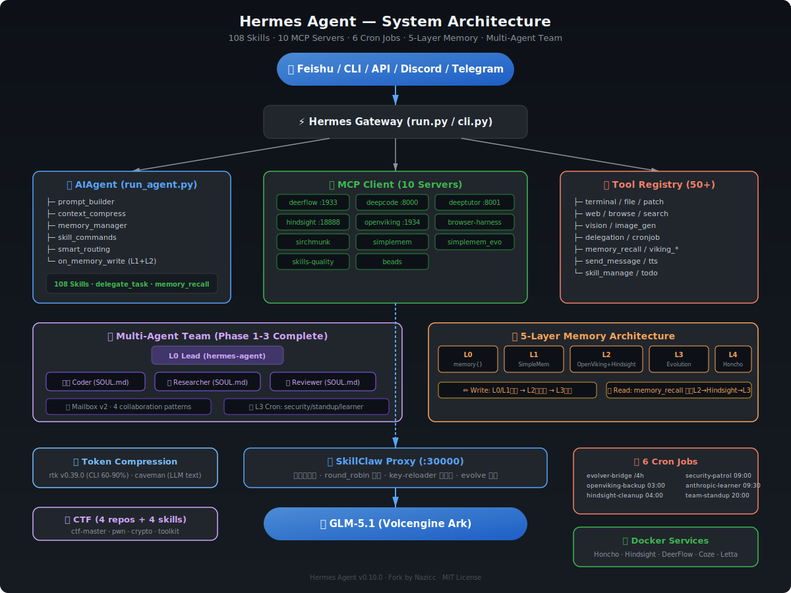

# Hermes Agent ☤ — Fork by Nazicc

<p align="center">
  <a href="https://github.com/Nazicc/hermes-agent/blob/main/LICENSE"></a>
  <a href="https://github.com/Nazicc/hermes-agent"></a>
  <a href="https://discord.gg/NousResearch"></a>
</p>

**English · 中文**

---

## 此分支有何不同

本 fork 在 Hermes Agent（NousResearch v0.10.0）基础上叠加了七大核心增强，同时保持与上游兼容。所有改动均在本地 `~/.hermes/` 运行时目录生效。

---

### 🛡️ 安全优先的开发规范

| 机制 | 说明 |
|------|------|
| **pre-commit hook** | 提交前扫描常见 secret 模式（`sk-`、`ghp_`、`AKIA`），匹配则阻断 |
| **post-commit hook** | 每次 `git commit` 自动 `make deploy` 同步 prerun scripts |
| **敏感信息安全** | 所有 API key 只通过环境变量引用，从不硬编码写入配置文件 |
| **.gitignore** | `.env`、`auth.json`、`state.db`、各类 `.pem`/`.ppk` 私钥、venv/ 均已排除 |
| **每日安全巡检** | `daily-security-patrol` cron 每天 09:00 自动扫描 git 敏感信息泄露 |

---

### 🔀 SkillClaw Proxy Layer

**SkillClaw** 是本地 LLM 流量代理层，运行于 `localhost:30000`：

- **多租户路由**：Token Plan Key + round_robin 负载策略
- **协议兼容**：OpenAI-compatible API，零成本切换模型
- **健康守护**：`skillclaw-health` + `skillclaw-key-reloader` launchd 持续监控 + 热重载
- **进化适配**：`skillclaw-evolve` 额外端口，供 Evolver 自我进化使用
- **配置隔离**：`.env` 中存储所有 key，SkillClaw 只读环境变量

```
hermes-agent → SkillClaw (:30000) → GLM-5.1 (Volcengine Ark)
```

---

### 🤖 三套 Agent 调度体系

| Agent | 能力 | 适用场景 |
|-------|------|---------|
| **DeerFlow** | 深度研究、Web 搜索、多步骤推理、21 内置 skills | 复杂调研任务、流式思考过程 |
| **DeepCode** | 任务规划、论文转代码、需求分析、工作流状态管理 | 代码生成、架构设计、paper 实现 |
| **DeepTutor** | 知识库 RAG、TutorBot 自定义教学、Co-Writer 交互学习 | 学习辅导、知识管理、问答笔记 |

**调度规则**：代码/架构 → DeepCode；知识/教学 → DeepTutor；深度研究 → DeerFlow；本地文件 → SirchMunk；RAG 知识库 → OpenViking

---

### 👥 多 Agent 团队协作 (Phase 1-3)

基于 Profile 一等公民的 Multi-Agent 架构，已完成 3 个阶段：

| Phase | 内容 | 状态 |
|-------|------|------|
| **Phase 1** | 3 个 Profile（Coder/Researcher/Reviewer）+ SOUL.md + peer_id 隔离 | ✅ |
| **Phase 2** | 4 种协作模式（Sequential/Parallel/Review/Iterative）+ 132/132 测试 | ✅ |
| **Phase 3** | Mailbox v2 安全加固 + 完整协作基础设施验证 | ✅ |

**四层架构**：

```
L0  Lead (hermes-agent)      — 任务分发、最终决策
L1  delegate_task            — 子任务隔离执行
L2  Profile (SOUL.md/.env)   — 一等公民，独立身份
L3  Cron Worker              — 定时巡检、日报告警
```

**核心组件**：
- `profiles/coder/SOUL.md` — 代码实现专家
- `profiles/researcher/SOUL.md` — 调研分析专家
- `profiles/reviewer/SOUL.md` — 代码审查专家
- `team/mailbox/mailbox.py` — Mailbox v2 消息路由（282 行）
- `docs/multi-agent-team-v3.md` — 完整设计文档（568 行）

---

### 🧠 五层记忆架构 (L0→L4)

基于 **SINK 设计模式** 的分层记忆系统，所有数据本地运行：

```
Layer   System             Engine                         写入路径                    读取路径
──────  ─────────────────  ─────────────────────────────  ──────────────────────      ───────────────────
L0      Memory Tool        内置 memory{} (2.2KB)          即时写入                    注入 prompt
L1      SimpleMem          LanceDB + embedding            content/write 即时          semantic_search
L2      OpenViking+Hindsight Docker+pgvector+RAG         session-buffer 批量         memory_recall 统一检索
L3      SimpleMem Evolution Gene + WorkingMemory          evolve_server 写入          evolution API
L4      Honcho SINK        Docker (API+Deriver+PG)        honcho_bridge.py 同步       honcho.chat() 按需
```

**数据流原则**：
- **写入**：L0/L1 即时写入；L2 通过 `on_memory_write` 双路径（content/write 即时 + session-buffer 批量）；L3 由 evolve_server 独占写入；L4 由 cron 每 4h 同步
- **读取**：统一走 L2（`memory_recall` → OpenViking → Hindsight → L3 降级检索），单读路径
- **Honcho 定位**：SINK（下游处理器），仅两个独特价值 — (1) Deriver 自动推导 (2) Dialectic 辩证推理；结论通过 `viking_remember` 回流 L2

---

### 📋 Manus-Style Task Planning

集成 **planning-with-files**。三份持久化 Markdown 在上下文丢失和会话重置中存活：

```
task_plan.md   — 阶段性路线图，带状态跟踪
findings.md    — 调研、发现、外部内容
progress.md    — 带时间戳的会话日志
```

---

### 🔄 Self-Evolution Loop

- **Evolver 集成** — `skills-evolution-from-research` 技能持续评估并整合外部研究
- **技能自动进化** — 复杂任务触发技能升级，带验证工作流
- **跨会话记忆** — FTS5 会话搜索 + LLM 摘要，跨会话召回决策
- **GEPA 优化** — DSPy + GEPA 算法驱动技能参数自动调优
- **drop_params 兼容** — 所有 DSPy LM 调用已添加 `drop_params=True`，解决 GLM-5.1/Ark 不支持 `json_object` 的问题
- **Anthropic 学习** — 每日 09:30 自动采集 Anthropic 博客，提取 Agent 自进化洞察写入 L2

---

### 🎯 CTF 综合能力

融合四大 CTF 知识库，构建互补的技能体系：

| 来源 | 内容 |
|------|------|
| **ctf-wiki** | 14 个方向完整理论知识（PWN/密码学/Web/逆向/杂项/区块链等） |
| **google-ctf** | 2017-2025 真实 CTF challenge（Docker/K8s 部署） |
| **awesome-ctf** | 工具链清单、平台索引、写作者社区 |
| **ctf-skills** | 实测可运行脚本模板（RSACTFTool/Pwntools/angr 等） |

**核心 CTF Skills**：`ctf-master`（综合入口）· `ctf-pwn`（PWN 深度）· `ctf-crypto-comprehensive`（密码学融合）· `ctf-skills-toolkit`（工具包）

---

### 🗜️ Token 压缩双引擎

| 工具 | 范围 | 压缩率 | 配置 |
|------|------|--------|------|
| **caveman** | LLM 文本 I/O 压缩 | lite → wenyan-ultra | `~/.config/caveman/config.json` |
| **rtk v0.39.0** | CLI 命令输出压缩 | 60-90% token 节省 | `~/.local/bin/rtk` |

两者互补：caveman 压缩大模型输入输出文本，rtk 压缩终端命令输出。rtk Hook 已注册到 Claude Code + Codex CLI。

---

### 🏗️ 108 Skills 技能体系

**108 个技能** 覆盖软件开发、研究、MLOps、生产力、安全等场景：

| 类别 | 代表技能 |
|------|---------|
| **软件开发** | `systematic-debugging` · `test-driven-development` · `spec-driven-development` · `context-engineering` |
| **Agent 集成** | `hermes-evolver-integration` · `codex` · `hermes-multi-agent-team` |
| **MLOps** | `peft` · `axolotl` · `huggingface-hub` · `llama-cpp` · `dspy` |
| **安全/CTF** | `git-history-security-response` · `ctf-master` · `ctf-pwn` · `ctf-crypto-comprehensive` |
| **RAG/知识** | `mem-search` · `obsidian` · `notion` |
| **记忆桥接** | `honcho-bridge-sync` · `hermes-agent-architecture` · `hermes-agent-git-workflow` |

---

## 系统架构



```
                        用户（飞书 / CLI / API / Discord / Telegram / ...）
                                      │
                       ┌──────────────▼──────────────┐
                       │      Hermes Gateway          │
                       │      run.py / cli.py         │
                       └──────────────┬──────────────┘
                                      │
           ┌──────────────────────────┼──────────────────────────┐
           │                          │                          │
┌──────────▼───────────┐ ┌───────────▼──────────┐ ┌─────────────▼──────────┐
│   AIAgent            │ │  MCP Client          │ │  Tool Registry         │
│   run_agent.py       │ │  (10 servers)        │ │  50+ 工具实现          │
│   ├─ prompt_builder  │ │  ├─ deerflow  (:1933)│ │  ├─ terminal/file      │
│   ├─ context_compress│ │  ├─ deepcode  (:8000)│ │  ├─ web/browse         │
│   ├─ memory_manager  │ │  ├─ deeptutor (:8001)│ │  ├─ vision/ocr         │
│   ├─ skill_commands  │ │  ├─ hindsight(:18888)│ │  ├─ delegation         │
│   ├─ smart_routing   │ │  ├─ openviking(:1934)│ │  ├─ memory_recall      │
│   └─ on_memory_write │ │  ├─ browser-harness  │ │  └─ ...                │
│      (L1即时+L2双路径)│ │  ├─ sirchmunk        │ └────────────────────────┘
└──────────────────────┘ │  ├─ simplemem        │
                         │  ├─ simplemem_evo    │
                         │  ├─ skills-quality   │
                         │  └─ beads            │
                         └──────────────────────┘
                                      │
                       ┌──────────────┴──────────────┐
                       │    SkillClaw (:30000)         │
                       │    本地 LLM 代理 + 负载均衡    │
                       │    + key-reloader 热重载       │
                       └──────────────┬──────────────┘
                       ┌──────────────▼──────────────┐
                       │   GLM-5.1 (Volcengine Ark)   │
                       └─────────────────────────────┘
```

### 多 Agent 团队架构

```
┌──────────────────────────────────────────────────────────────┐
│                    L0 Lead (hermes-agent)                     │
│                    任务分发 · 最终决策                          │
└──────────┬───────────────────┬──────────────────┬────────────┘
           │                   │                  │
    ┌──────▼──────┐   ┌───────▼──────┐   ┌──────▼──────┐
    │   Coder     │   │  Researcher  │   │  Reviewer   │
    │  (SOUL.md)  │   │  (SOUL.md)   │   │ (SOUL.md)   │
    │  代码实现    │   │  调研分析     │   │  代码审查    │
    └─────────────┘   └──────────────┘   └─────────────┘
           │                   │                  │
    ┌──────▼───────────────────▼──────────────────▼────────────┐
    │              Mailbox v2 (team/mailbox/)                   │
    │         消息路由 · 安全加固 · peer_id 隔离                  │
    └──────────────────────────┬───────────────────────────────┘
                               │
    ┌──────────────────────────▼───────────────────────────────┐
    │              L3 Cron Workers                              │
    │  security-patrol · team-standup · anthropic-learner       │
    └──────────────────────────────────────────────────────────┘
```

---

## 记忆数据流转图

```
┌─────────────────────────────────────────────────────────────────────────────┐
│                          写入路径 (Write Path)                               │
│                                                                             │
│  用户消息/Agent输出                                                          │
│       │                                                                     │
│       ├──→ memory{} ────────────────────────→ L0 (即时, 2.2KB)             │
│       │                                                                     │
│       ├──→ content/write ──────────────────→ L1 SimpleMem (即时)           │
│       │                                                                     │
│       ├──→ on_memory_write ─┬─ content/write → L1 SimpleMem (即时)        │
│       │                     └─ session buffer → L2 OpenViking (批量)       │
│       │                                        + Hindsight (on_session_end) │
│       │                                                                     │
│       ├──→ evolve_server ─────────────────→ L3 Evolution DB (独立)         │
│       │                                                                     │
│       └──→ honcho_bridge.py (cron /4h) ──→ L4 Honcho (SINK同步)           │
│              ├─ workspace/peer 同步                                        │
│              └─ 结论 → viking_remember → 回流 L2                           │
│                                                                             │
├─────────────────────────────────────────────────────────────────────────────┤
│                          读取路径 (Read Path)                                │
│                                                                             │
│  memory_recall (统一检索入口)                                                │
│       │                                                                     │
│       ├──→ L2 OpenViking (viking_search/read/browse)  ← 优先级最高          │
│       │                                                                     │
│       ├──→ L2 Hindsight (recall/reflect)              ← 图推理补充          │
│       │                                                                     │
│       ├──→ L3 Evolution (gene_list/working_memory)    ← 降级检索           │
│       │                                                                     │
│       ├──→ 去重合并 → 返回结果                                             │
│       │                                                                     │
│       └──→ 低结果时触发 Hindsight reflect → 深度推理补充                    │
│                                                                             │
│  按需读取 (非统一路径)                                                       │
│       │                                                                     │
│       ├──→ L0 memory{} (自动注入 prompt)                                    │
│       ├──→ L1 SimpleMem (search_memories/session_search)                   │
│       └──→ L4 Honcho (honcho.chat() 一次性辩证, 不持久化)                   │
│                                                                             │
└─────────────────────────────────────────────────────────────────────────────┘
```

---

## Honcho SINK 架构

```
┌──────────────────────────────────────────────────────────────────┐
│                    Honcho L4 — SINK Mode                         │
│                                                                  │
│  ┌─────────────┐    ┌─────────────┐    ┌──────────────────┐     │
│  │ honcho-api  │    │honcho-deriver│    │ honcho-postgres  │     │
│  │  :8889      │←──→│  (GLM-5.1)  │←──→│  :5433 (pgvector)│     │
│  │ patched-v5  │    │ drop_params  │    │ honcho-pgdata    │     │
│  └──────┬──────┘    └──────────────┘    └──────────────────┘     │
│         │                                                        │
│  honcho_bridge.py (163 行)                                       │
│  ├─ sync_sessions()  — 增量同步会话 → Honcho workspace          │
│  ├─ sync_conclusions() — Deriver结论 → viking_remember → L2    │
│  └─ chat() — 一次性辩证对话 (不持久化)                            │
│                                                                  │
│  Cron: evolver-bridge / 每4h                                     │
│  Restart: unless-stopped (所有3个容器)                            │
│  Patch: 5个 (drop_params, f-string, health, auth, CORS)         │
└──────────────────────────────────────────────────────────────────┘
```

---

## 项目结构

```
~/.hermes/
├── config.yaml               # 主配置（API provider、toolsets、platforms、10个MCP server）
├── .env                      # 所有敏感密钥（.gitignore 排除，不上传）
├── hermes-agent/             # 主代码仓库（git 管理）
│   ├── run.py               # Gateway 入口
│   ├── cli.py               # CLI 入口（hermes 命令）
│   ├── run_agent.py         # AIAgent 核心
│   ├── honcho_bridge.py     # Honcho L4 SINK 桥接 (163行)
│   ├── profiles/            # 多 Agent Profile
│   │   ├── coder/           # Coder SOUL.md + config
│   │   ├── researcher/      # Researcher SOUL.md + config
│   │   └── reviewer/        # Reviewer SOUL.md + config
│   ├── team/mailbox/        # Mailbox v2 消息路由 (282行)
│   ├── agent/               # prompt builder、context compressor、memory manager...
│   ├── tools/               # 50+ 工具实现
│   ├── gateway/             # 消息平台网关（Feishu/Discord/Telegram/...）
│   ├── mcp-servers/         # 自定义 MCP 实现
│   │   ├── deerflow-mcp/
│   │   ├── deepcode-mcp/
│   │   ├── deeptutor-mcp/
│   │   └── browser-harness-mcp/
│   ├── skills_quality/      # Skills 质量评分 MCP
│   ├── cron/                # Cron 预检脚本 + 测试
│   └── tests/               # pytest 测试套件
├── skills/                   # 108 个技能（多分类）
│   ├── ctf/                 # CTF 综合技能
│   ├── mlops/               # 训练/推理工具
│   ├── software-development/# 开发流程
│   ├── devops/              # DevOps 工具
│   └── ...
├── SkillClaw/               # 本地 LLM 代理层
├── deer-flow-repo/          # DeerFlow 完整仓库
├── scripts/
│   ├── hindsight_mcp.py     # Hindsight MCP 入口
│   ├── simplemem_mcp.py     # SimpleMem MCP 入口
│   └── skillclaw_key_reloader.py  # SkillClaw key 热重载
├── memories/                 # 记忆系统数据
├── simplemem-data/          # SimpleMem LanceDB 数据
├── simplemem_evolution/      # Evolution/Gene/WorkingMemory
├── sirchmunk-data/          # SirchMunk DuckDB 数据 (477MB)
├── openviking-data/         # OpenViking RAG 数据
├── state.db                 # Hermes 主状态库 (11MB)
├── cron/
│   └── output/              # 任务输出
├── launchd/                  # launchd plist 服务 (9个)
│   ├── com.hermes.skillclaw-proxy.plist
│   ├── com.hermes.skillclaw-health.plist
│   ├── com.hermes.deepcode-*.plist
│   ├── com.hermes.deeptutor-*.plist
│   ├── com.hermes.deerflow-mcp.plist
│   ├── com.hermes.sirchmunk.plist
│   └── com.hermes.openviking.plist
└── browser-harness-workspace/  # 浏览器自动化工作区
```

---

## 平台接入

| 平台 | 状态 | 说明 |
|------|------|------|
| **飞书** | ✅ 已接入 | 配置于 `config.yaml` |
| **CLI** | ✅ | `hermes` 命令行入口 |
| **API Server** | ✅ | localhost:8642（key 认证） |
| **Telegram/Slack/Discord** | 配置 | `config.yaml` 中配置即可启用 |

---

## 定时任务

| Job | 触发 | 功能 | 投递 |
|-----|------|------|------|
| **evolver-bridge** | 每4h | Session logs 同步、Evolver 进化分析、Honcho SINK 同步 | origin |
| **openviking-backup** | 每天 03:00 | OpenViking 数据快照备份 | origin |
| **hindsight-cleanup** | 每天 04:00 | Docker 健康检查 + 数据库清理 | origin |
| **daily-security-patrol** | 每天 09:00 | Git 敏感信息扫描、凭证审计 | origin |
| **anthropic-daily-learner** | 每天 09:30 | Anthropic 博客采集 → Agent 自进化洞察 → L2 | origin |
| **daily-team-standup** | 每天 20:00 | 团队状态汇总、Git 活动报告 | origin |

所有 6 个 cron job 均使用 **GLM-5.1/custom** provider。

---

## Docker 服务

| 容器 | 端口 | 用途 | 重启策略 |
|------|------|------|---------|
| **honcho-api** | :8889 | Honcho API (patched-v5) | unless-stopped |
| **honcho-deriver** | 8889/internal | GLM-5.1 辩证推导 | unless-stopped |
| **honcho-postgres** | :5433 | pgvector 存储 | unless-stopped |
| **hindsight** | :18888/:19999 | 经验记忆 + 图推理 | Docker compose |
| **hindsight-db** | 5432/internal | Hindsight PostgreSQL | Docker compose |
| **deer-flow-nginx** | :2026 | DeerFlow 研究网关 | Docker compose |
| **deer-flow-gateway** | 2024/internal | DeerFlow 后端 | Docker compose |
| **coze-web** | :8888 | Coze Studio | Docker compose |
| **letta-postgres** | :15432 | Letta PostgreSQL | Docker compose |

---

## 持久化 & 重启安全

| 组件 | 持久化方式 | 重启后自动恢复 |
|------|-----------|--------------|
| Hermes Agent | v0.10.0 pip install -e | ✅ |
| Honcho 3 容器 | Docker volumes + unless-stopped | ✅ |
| Hindsight | Docker volumes + compose | ✅ |
| DeerFlow | Docker compose | ✅ |
| SkillClaw | launchd plist (proxy + health + key-reloader) | ✅ |
| DeepCode/DeepTutor | launchd plist | ✅ |
| OpenViking | launchd plist + data dir | ✅ |
| SirchMunk | launchd plist + DuckDB | ✅ |
| state.db | 磁盘 (11MB) | ✅ |
| SimpleMem | LanceDB (磁盘) | ✅ |
| Evolution | evolution.db (磁盘) | ✅ |
| Cron jobs | jobs.json (磁盘) | ✅ |

---

## Token 压缩工具

| 工具 | 类型 | 安装位置 | Hook |
|------|------|---------|------|
| **rtk v0.39.0** | CLI 输出压缩 | `~/.local/bin/rtk` | Claude Code + Codex CLI |
| **caveman** | LLM 文本压缩 | `~/.config/caveman/` | hermes-agent skill |

```bash
# rtk 用法
rtk git status      # 60-90% token 节省
rtk ls / rtk tree   # 文件浏览压缩
rtk gain            # 查看节省统计
rtk discover        # 分析历史命令中的优化机会
```

---

## Changelog

#### 2026-05-12
- README v3.0 重写 — 多 Agent 团队 (Phase 1-3)、Token 压缩双引擎 (rtk + caveman)、6 个 cron job、10 MCP servers
- 架构图更新 — 多 Agent 团队四层架构、SkillClaw key-reloader、Profile 一等公民
- 记忆流转图更新 — Anthropic 学习者写入 L2、安全巡检 cron
- `cc21564` feat(team): Phase 3 complete — mailbox v2 security hardening
- `567c095` feat: multi-agent team Phase 2 — 4 collaboration patterns (132/132 tests)
- `30bcb4a` feat: multi-agent team Phase 1 — 3 Profiles with SOUL.md + peer_id isolation
- `f978598` feat: replace MiniMax with GLM-5.1/Volcengine as default provider
- feat: rtk v0.39.0 安装 + Claude/Codex Hook 注册
- feat: anthropic-daily-learner cron (09:30) + daily-team-standup cron (20:00)
- feat: daily-security-patrol cron (09:00) — Git 敏感信息自动扫描

#### 2026-05-11
- README 全面重写 — 五层记忆架构 (L0→L4)、SINK 数据流转图、202 skills、12 MCP servers、5 cron jobs
- 架构图更新 — 增加 Honcho/beads MCP、memory_recall 统一检索、on_memory_write 双路径

#### 2026-05-09
- `8aa8c2d` fix: add `drop_params=True` to all dspy.LM calls — GLM-5.1/Ark 不支持 `json_object` response_format
- `3daaf24` feat: Honcho L4 SINK bridge — GLM-5.1 辩证引擎，163 行桥接
- `25b8c31` fix: session bloat cleanup — 80+ 消息压缩、VACUUM 修复

#### 2026-05-08
- `dac448a` feat(memory): memory_recall 统一分层检索 (P4) — L2→Hindsight→L3 降级 + 去重
- `a36a5e9` feat(memory): Hindsight 整合为 L2 图推理层 — on_session_end 同步
- `0565e25` feat(memory): on_memory_write 双路径 — content/write 即时 + session-buffer 批量
- `9e3df2ee` feat(skill): add Anti-Patterns section to github-code-review — GEPA evolved output

#### 2026-05-06
- `7c722121` feat(credential_pool): export active key for SkillClaw hot-reload
- Honcho Docker 容器重启策略修复 — `no` → `unless-stopped`
- 全系统持久化审计 — 所有服务重启安全

#### 2026-05-04
- `d792c4a6` feat(ctf): add fused CTF skills — ctf-master/pwn/crypto-comprehensive/skills-toolkit

<!-- CHANGELOG_MARKER -->

---

## License

MIT — same as upstream.
